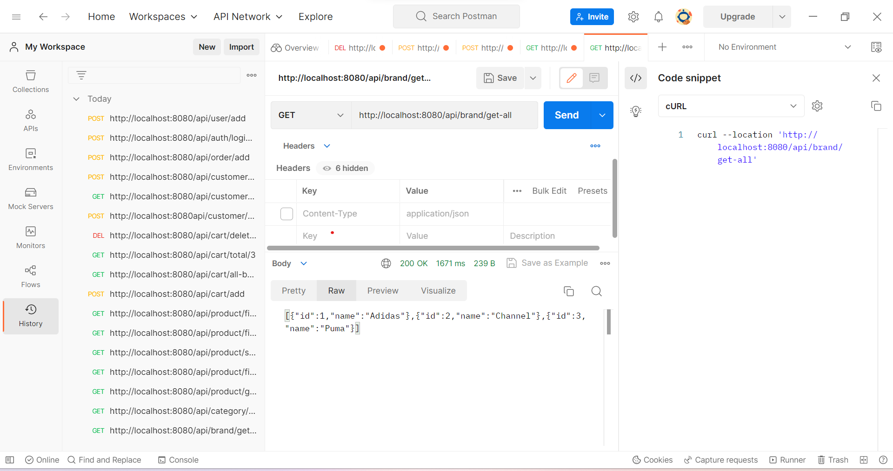
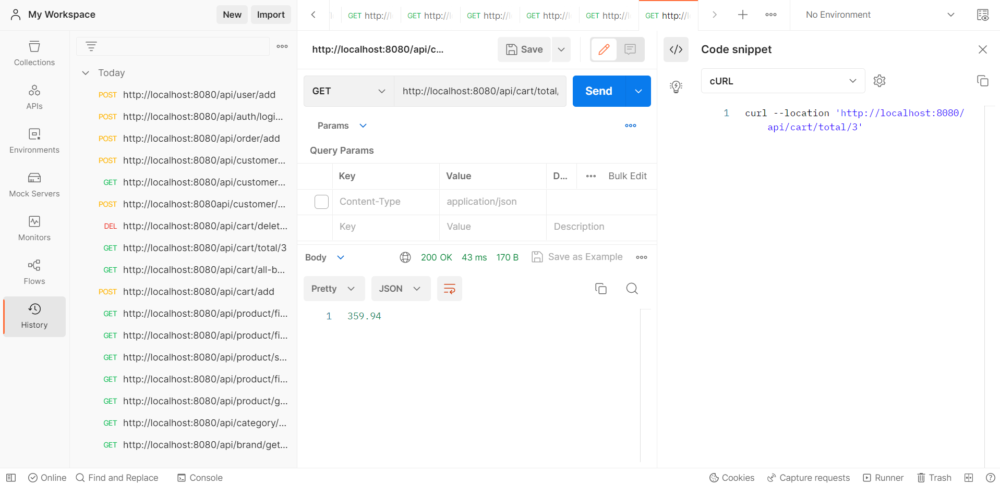
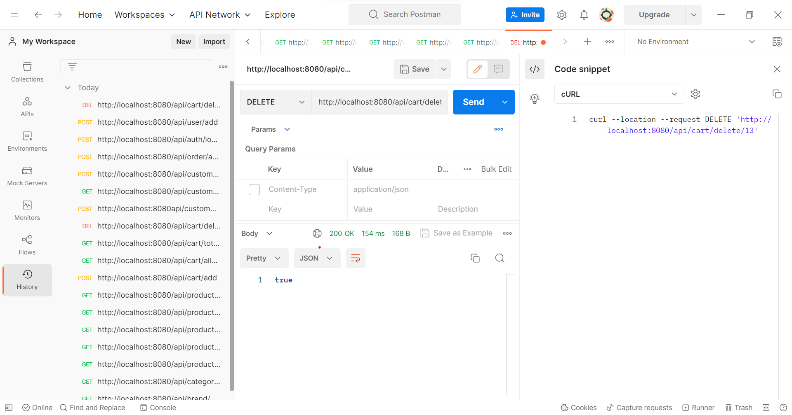
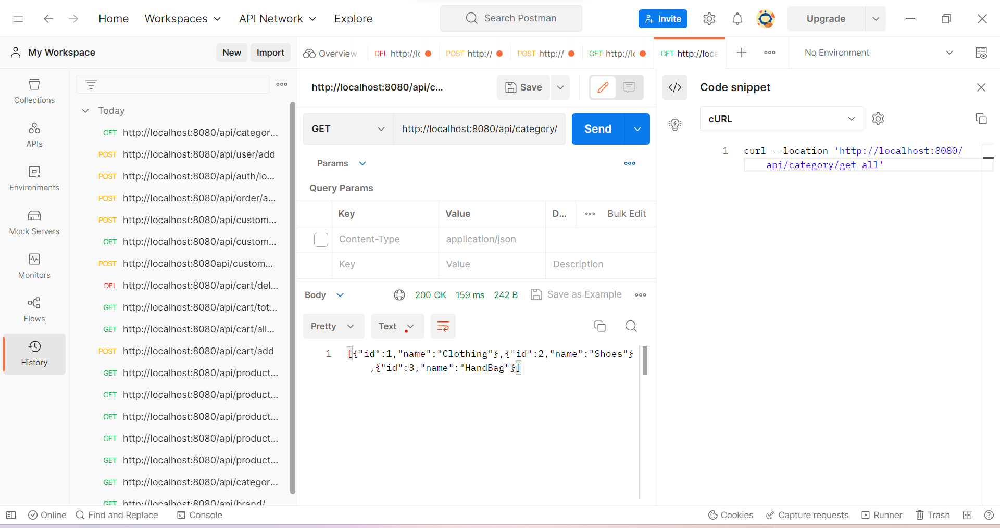
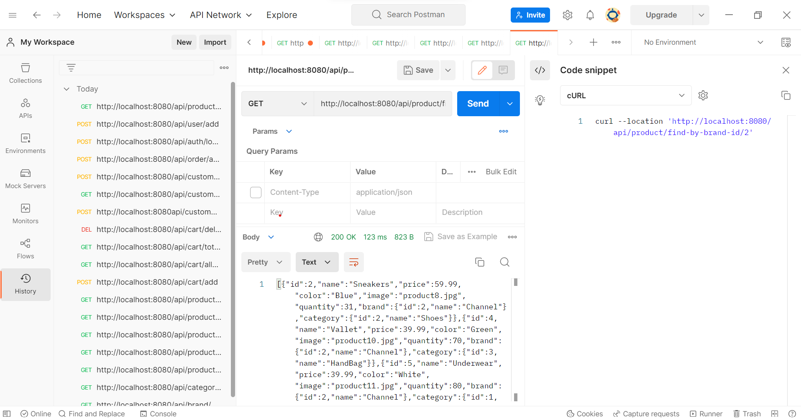
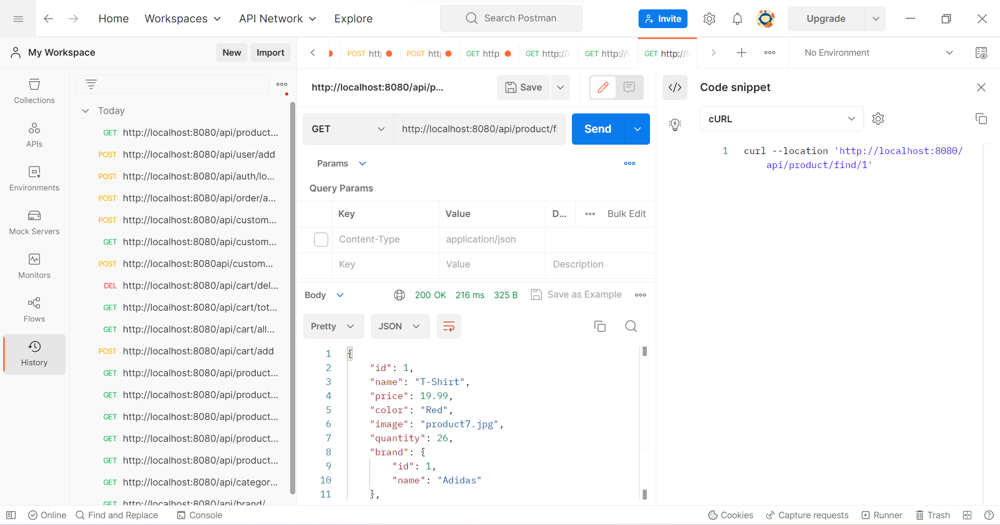
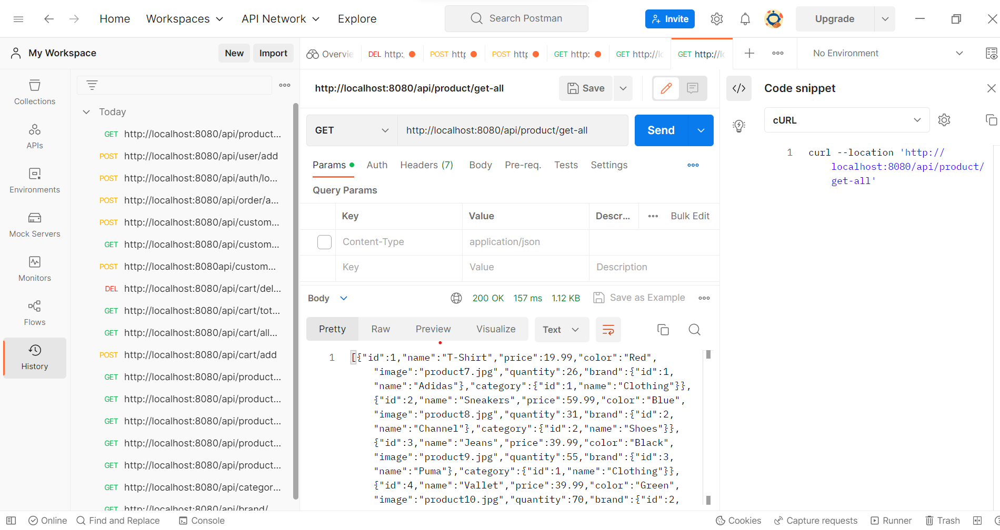
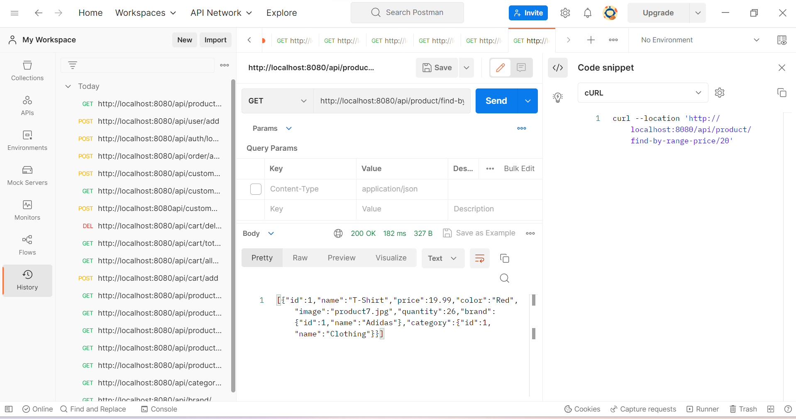

- This web application is built on the Spring Boot platform and constructed with Maven using the Java language. It integrates platforms such as Thymeleaf and Hibernate.

- This web application works by the user sending a request to the server, and from the server sending a request to the API. The API then responds to the server, which in turn responds to the user.(client-server architecture)

- Step by step run this project: 

    + Download XAMPP or a similar application.

    + Install the necessary tools: Make sure you have the Java Development Kit (JDK) and a build tool Maven installed on your computer.

    + Download the project: Download this project source code.

    + Import file spring_ecommerce.sql in XAMPP or a similar application.

    + Build the project: Navigate to the project directory and use the build tool to build the project.

    + Run the project: Once the project is built, you can run it using the build tool.

    + Access the application: Once the application is running, you can access it by opening a web browser and navigating to http://localhost:8080, assuming that the application is configured to run on port 8080.

- Full CURL commands or Postman snapshots to verify the APIs

    + cURL: "/api/brand/get-all"

    + cURL: "/api/cart/total/{id}"

    + cURL: "/api/cart/delete/{id}"

    + cURL: "/api/category/get-all"

    + cURL: "/api/product/find-by-brand-id/{id}"

    + cURL: "/api/product/find/{id}"

    + cURL: "/api/product/get-all"

    + cURL: "/api/product/search/{id}"

